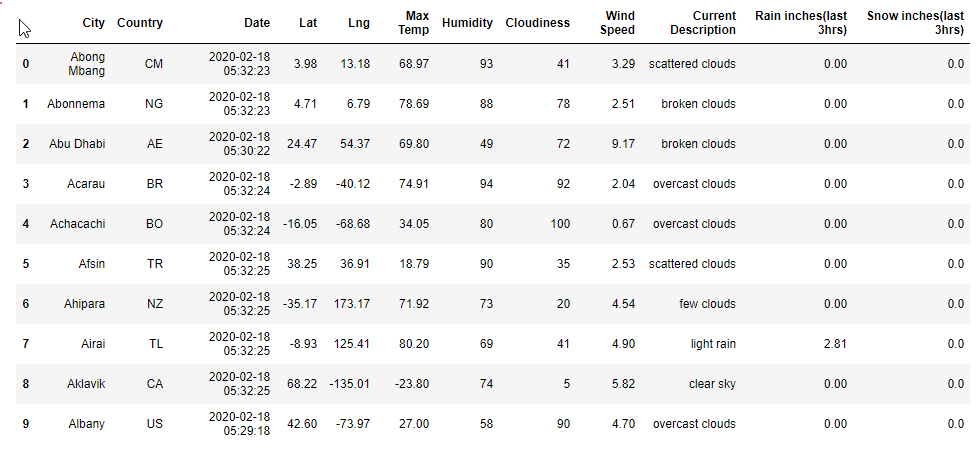
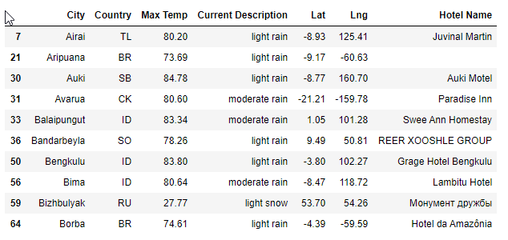
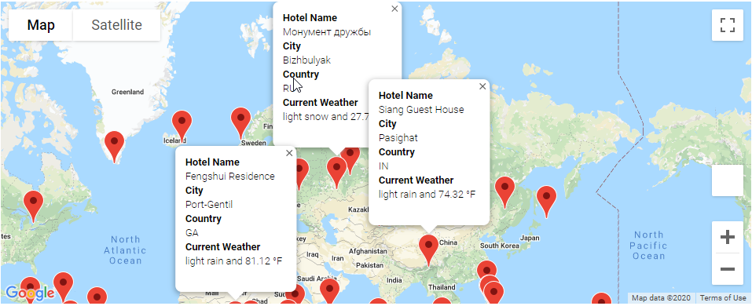
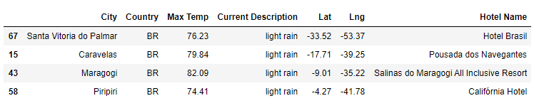
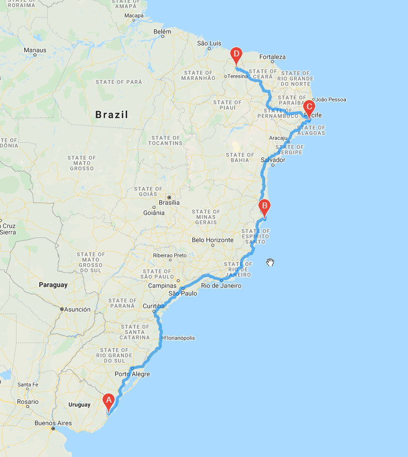
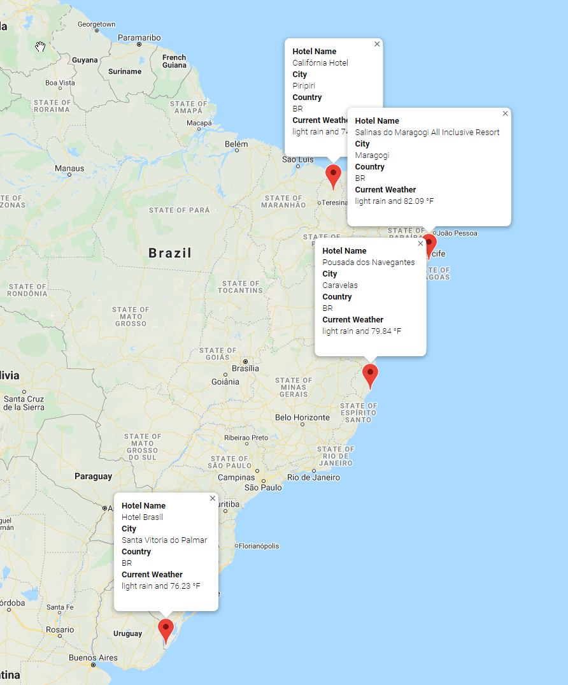

# World Weather Analysis

## Plan My Trip

### 1. Get the Weather Description and Amount of Precipitation for Each City

***Collect data with this information***

- Latitude and longitude
- Maximum temperature
- Percent humidity
- Percent cloudiness
- Wind speed
- Weather description
- Raining 
- Snowing

***Create Data Frame***

***How many cities have recorded rainfall or snow?***

### 83

***Save the weather Data to CSV***

[WeatherPy_challenge.csv](weather_data/WeatherPy_challenge.csv)

***Source Code***

[Weather_Database.ipynb](Weather_Database.ipynb)

### 2. Have Customers Narrow Their Travel Searches Based on Temperature and Precipitation

***Collect input data from the user***

***Create Data Frame after filtering***

***Save the search data to CSV***

[WeatherPy_vacation.csv](weather_data/WeatherPy_vacation.csv.csv)

***Screenshot: The marker layer with google maps***

***Source Code***

[Vacation_Search.ipynb](Vacation_Search.ipynb)

### 3. Create a Travel Itinerary with a Corresponding Map

***Create Data Frame with at least 4 cities***

***Screenshot: the route of the trip through 4 cities map***

***Screenshot: The marker layer of 4 cities map***

***Source Code***

[Vacation_Itinerary.ipynb](Vacation_Itinerary.ipynb)
